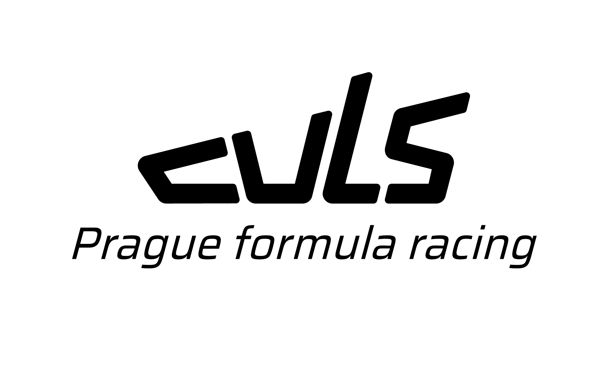
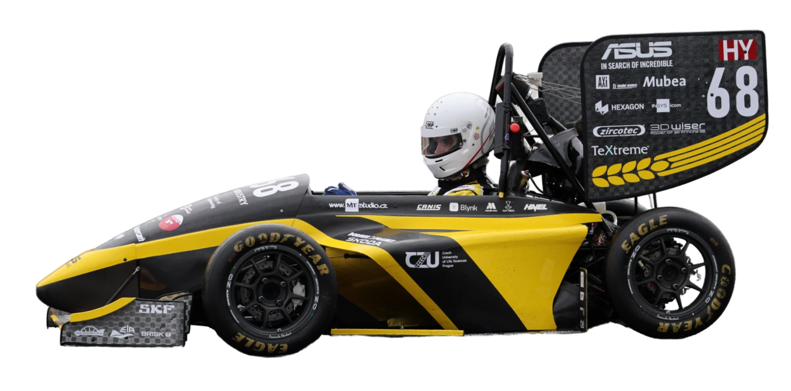

<a href="https://culsracing.cz">
<picture>
  <source media="(prefers-color-scheme: dark)" srcset="./../CULS_logo_white.png">
  
</picture>
</a>

 

## </img> About us

We are group of dedicated engineering students from the Czech University of Life Sciences, competing in the prestigious Formula Student competition.
Our team CULS Prague formula racing was founded by the students of the Faculty of Enginering at the Czech University of Life Sciences in Prague in 2011 under the old name Rebels Racing.
Today we participate with the new name in the international engineering competition Formula Student.
